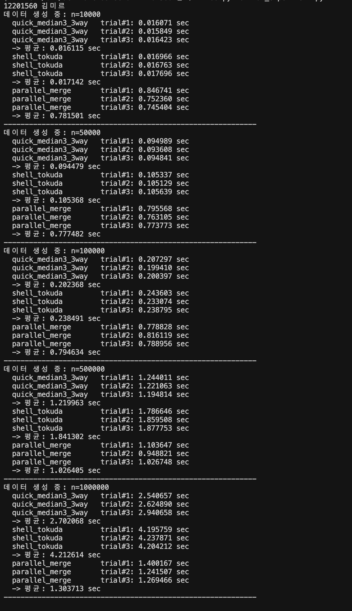

# EEC3414 알고리즘 H/W #1 보고서

## 1. 개요

본 과제의 목표는 서로 다른 특성을 갖는 세 가지 정렬 알고리즘(Quick Sort 변종, Shell Sort 변종, 병렬 정렬)을 구현하고,  
동일한 랜덤 데이터셋에 대해 입력 크기 n을 변화시키며 실행시간을 비교 분석하는 것임.

실험 대상 알고리즘:

1. Quick Sort 변종: **Median-of-Three + 3-way partition**
2. Shell Sort 변종: **Tokuda gap sequence**
3. 병렬 정렬: **Multiprocessing 기반 Parallel Merge Sort**

---

## 2. 구현상 특징

### 2.1 Quick Sort 변종

- 피벗 선택: 첫 원소, 중간 원소, 마지막 원소 중 **중앙값(Median-of-Three)** 사용함
- 분할 방식: `< pivot`, `== pivot`, `> pivot`의 **3-way partition** 적용함

선택 이유:

- 정렬된 입력/역정렬 입력에서 편향 분할이 발생할 가능성을 줄여 평균 성능 안정화함
- 중복 값이 많은 경우 2-way partition보다 재귀 호출 수를 줄여 성능 향상시킴

### 2.2 Shell Sort 변종

- gap sequence로 **Tokuda 수열** 사용함
- 각 gap마다 gapped insertion sort 수행함

선택 이유:

- 단순 절반 감소 방식(gap = n/2, n/4, ...)보다 실제 성능이 더 좋게 나오는 경우가 많음
- 구현이 비교적 간단하면서도 실험적으로 효과적인 gap 전략임

### 2.3 병렬 정렬 알고리즘

- 입력 데이터를 코어 수 기준으로 여러 청크로 분할함
- 각 청크를 병렬 프로세스에서 정렬함
- 정렬된 청크를 순차적으로 병합함

특징:

- 큰 n에서 병렬화 이점 기대됨
- 작은 n에서는 프로세스 생성/직렬화 오버헤드로 인해 불리할 수 있음

---

## 3. 실험 환경 및 방법

- 언어: Python 3
- 라이브러리: matplotlib
- 데이터셋: 정수 랜덤 데이터(예: 0 ~ 1,000,000,000)
- 입력 크기 n 예시: 10,000 / 50,000 / 100,000 / 500,000 / 1,000,000
- 각 n마다 동일 데이터셋을 세 알고리즘에 공통 입력으로 사용함
- 각 케이스 반복 실행(예: 3회) 후 평균 실행시간 사용함
- 결과 저장: `results/benchmark_results.csv`
- 그래프 저장: `results/performance_plot.png`

---

## 4. 실행 결과

### 4.1 실행 화면 캡처

- 터미널 실행 화면 캡처: `results/run_capture_12201560.png`
- 캡처 상단에 **이름/학번(12201560 김미르)** 표시 확인됨

### 4.2 성능 비교 표

| n | quick_median3_3way (sec) | shell_tokuda (sec) | parallel_merge (sec) |
|---|---:|---:|---:|
| 10,000 | 0.016115 | 0.017142 | 0.781501 |
| 50,000 | 0.094479 | 0.105368 | 0.777482 |
| 100,000 | 0.202368 | 0.238491 | 0.794634 |
| 500,000 | 1.219963 | 1.841302 | 1.026405 |
| 1,000,000 | 2.702068 | 4.212614 | 1.303713 |

### 4.3 성능 비교 그래프

- `results/performance_plot.png` 삽입
- x축: 입력 크기 n, y축: 평균 실행시간(sec)

---

## 5. 분석

실험 결과, n=10,000~100,000 구간에서는 Quick Sort 변종이 가장 빠르게 측정됨.  
Shell Sort(Tokuda)는 Quick Sort보다 소폭 느리지만 증가율은 유사하게 관찰됨. 반면 병렬 정렬은 작은 n에서  
프로세스 생성/직렬화 오버헤드가 크게 작용하여 0.77~0.79초 수준으로 상대적으로 비효율적이었음.

n=500,000 이상에서는 병렬 정렬의 이점이 나타나기 시작함. n=500,000에서 병렬 정렬(1.026405s)은  
Quick Sort 변종(1.219963s)보다 빨랐고, n=1,000,000에서도 병렬 정렬(1.303713s)이 Quick Sort 변종(2.702068s) 및  
Shell Sort(4.212614s)보다 우수한 성능을 보임. 즉, 병렬 정렬은 입력이 충분히 클 때 오버헤드를 상쇄하며 성능 우위를 보였음.

Quick Sort 변종의 경우 Median-of-Three 피벗 선택 덕분에 편향 분할 가능성을 줄였고,  
3-way partition으로 중복 키 처리 시 불필요한 재귀 분할을 줄일 수 있었음. 이로 인해 중간 크기까지 안정적인 고성능을 보임.

Shell Sort의 Tokuda gap sequence는 단순 절반 감소 gap보다 효율적인 삽입 이동을 기대할 수 있으나,  
본 실험의 랜덤 대규모 데이터에서는 O(n log n) 계열 정렬 대비 증가폭이 더 크게 나타남.  
특히 n=1,000,000에서 Quick Sort 대비 약 1.56배 정도 느린 결과를 보임.

종합하면, 작은 입력에서는 Quick Sort 변종이 유리하고 매우 큰 입력에서는 병렬 정렬이 더 유리함.  
성능 분기점은 본 환경에서 약 n=500,000 부근으로 관찰되며, 이는 CPU 코어 수, 메모리 대역폭, 프로세스 오버헤드에 따라 변할 수 있음.

---

## 6. 결론

본 과제에서는 Quick Sort 변종, Shell Sort 변종, 병렬 정렬을 구현하고 동일 데이터셋 기반 성능 비교를 수행했음.  
실험 결과, 작은~중간 크기 입력에서는 Quick Sort 변종이 가장 효율적이었고 큰 입력(n>=500,000)에서는 병렬 정렬이 가장 우수했음.  
Shell Sort(Tokuda)는 구현 간결성은 좋지만 대규모 랜덤 데이터에서 상대적으로 느리게 측정됨.

한계점으로는 Python 런타임 특성상 알고리즘 자체 성능 외에 인터프리터 및 프로세스 오버헤드 영향이 존재한다는 점임.  
향후 개선으로 C/C++ 기반 재구현, 병렬 병합 단계 최적화, CUDA 기반 병렬 정렬 구현을 통해 추가적인 성능 향상을 기대할 수 있음.

---

## 7. 제출 전 체크리스트

- [ ] I-class 지정 서약서 표지 사용
- [ ] 개요/구현상 특징/실행 화면/결론 포함
- [ ] pivot 방식, gap sequence 설명 포함
- [ ] n 변화 실험 + 동일 데이터셋 비교 수행
- [ ] 성능 비교 그래프 포함
- [ ] 실행 캡처에 이름/학번 표시
- [ ] debug 디렉토리 제외 후 프로젝트 zip 제출
